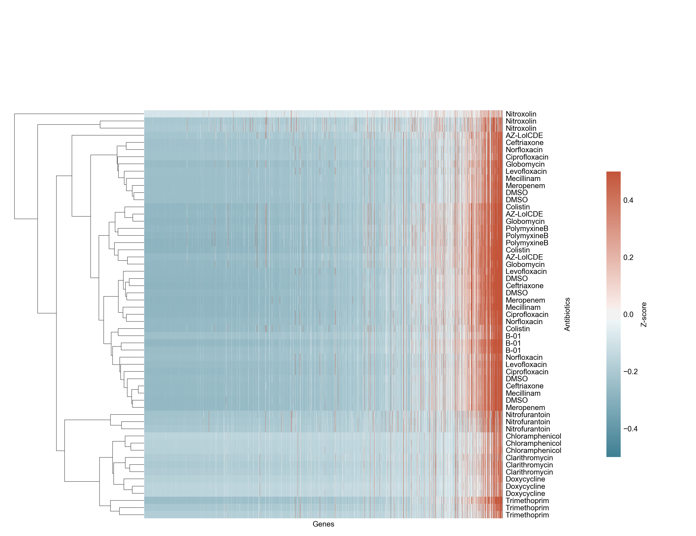

# Identifying antibiotic mechanisms of action through differential expression analysis

Final project for 20.440 Spring 2020 with Abhishek Aditham.

Microarray data has commonly been used in the past to identify what genes in bacterial genomes antibiotics act on. Using newer RNA-seq datasets we plan to compare insights from both datatypes and see whether we can cluster antibiotics by mechanism of action (MOA) by looking at gene expression only. We hope to identify upstream effector genes and additionally generate a predictor of antibiotic MOA.

## Data
RNA-Seq data from the following paper deposited on the NCBI Gene Expression Omnibus as [GSE110137](https://www.ncbi.nlm.nih.gov/geo/query/acc.cgi?acc=GSE110137) was used to cluster the gene expression profiles of <em>E. coli</em> treated with different antibiotics.

Zoffmann, S., Vercruysse, M., Benmansour, F. <em>et al.</em> Machine learning-powered antibiotics phenotypic drug discovery. <em>Sci Rep</em> **9,** 5013 (2019).

## Folder structure
#### `data/`
Contains the RPKM matrix and metadata from Zoffmann <em>et al.</em> used to generate the clustermap.
#### `code/`
Contains the main code `clustermap_test.ipynb` that generates a DataFrame from the RPKM matrix, calculates z-scores, clusters z-scores, and plots.
#### `figures/`
Contains `clustermap_test.png` generated by the notebook.

Note that different replicates of the same condition do not seem to cluster well. More thorough normalization done through [DESeq2](https://doi.org/10.1186/s13059-014-0550-8) is being attempted.

## Installation
Running `code/clustermap_test.ipynb` or `code/cluster_map.py` generates the figure `clustermap_test.png`.

Dependancies are listed in `requirements.txt` and can be installed directly using:

	pip install -r requirements.txt

Note seaborn 
is needed over 0.9.0.

 

